# Denis Novicov

Привет!  
Я **Denis**, увлеченный тестировщик программного обеспечения. Люблю порядок в хаосе багов и красоту в автоматизации. Мой GitHub — это не только портфолио, но и отражение пути роста.

---

## Обо мне

- 🔭 Сейчас работаю над автотестами и CI/CD для повышения стабильности проектов.
- 🌱 Изучаю QA Manual и Automation, фокус на: Postman, Selenium, TestNG, JUnit, Java, Python, SQL.
- 📊 Активно изучаю базы данных, REST API и создаю полноценные end-to-end сценарии.
- 👯 Ищу возможности для сотрудничества в QA и DevOps-проектах.
- ⚡ Придерживаюсь принципа непрерывного улучшения.
- 📈 Верю, что качественное тестирование = качественный продукт.

---

## Мой стек и инструменты

### Автоматизация и тестирование

### CI/CD и контроль версий

### Языки и разметка

### Среда разработки и инструменты

### Базы данных и документация

### Трекеры задач и DevOps

---

### Дополнительные инструменты (использовались эпизодически)

## Проекты

| Проект                       | Тип тестирования | Стек                                    | Ссылка                                                                       |
| ---------------------------- | ---------------- | --------------------------------------- | ---------------------------------------------------------------------------- |
| BreakToMake (Modulconstruct) | Automation UI    | Java, Selenium, Allure, GitHub Actions  | [Посмотреть](https://github.com/dema28/breaktomake)                          |
| CrashProof (Modulconstruct)  | Automation UI    | Python, Selenium, Allure, GitHub Action | [Посмотреть](https://github.com/dema28/CrashProof)                           |
| BreakToMake (Modulconstruct) | Manual UI        | Checklists, Bug Reports, Markdown Docs  | [Посмотреть](https://github.com/dema28/BreakToMake/tree/main/manual_testing) |

---

## Сертификаты

---

## Чем могу быть полезен команде

- Проведу ручное и автоматизированное тестирование продукта
- Настрою CI/CD и отчёты Allure
- Составлю понятные тест-кейсы и чек-листы
- Протестирую API и базы данных
- Внедрю культуру качества в команде

---

## GitHub Статистика

### Полугодовой календарь коммитов

<<<<<<< HEAD
=======
### :hammer_and_wrench: Languages and Tools :
  &nbsp;
  &nbsp;
  &nbsp;
  &nbsp;
  &nbsp;
 &nbsp;
 &nbsp;
 
<!-- ### Календарь за полный год -->
<!--  -->
>>>>>>> 64e8a49e8ca13f4ea2c84b0aa40e44fc876ec9bd

---

## Связаться со мной

- Email: dema28ster@gmail.com
- LinkedIn: [Denis Novicov](https://www.linkedin.com/in/denis-novicov-dema28ster)
- Twitter: [@Denis_Novicov](https://x.com/Denis_Novicov)
- Сайт-портфолио: [dema28.github.io](https://dema28.github.io/Denis_Novicov.github.io/)
