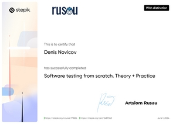
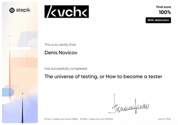
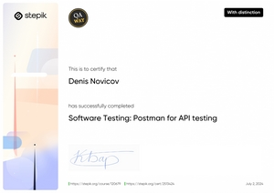
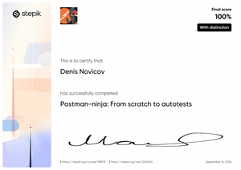
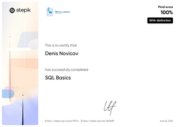

# Denis Novicov

Hi there!  
I'm **Denis**, a passionate software tester. I love finding order in bug chaos and elegance in automation. My GitHub is not just a portfolio but a reflection of my growth path.

---

## About Me

- 🔭 Currently working on autotests and CI/CD to improve project stability.
- 🌱 Studying QA Manual and Automation, focused on: Postman, Selenium, TestNG, JUnit, Java, Python, SQL.
- 📊 Exploring databases, REST APIs, and building complete end-to-end test scenarios.
- 👯 Open to collaboration in QA and DevOps-related projects.
- ⚡ Committed to continuous improvement.
- 📈 I believe quality testing = quality product.

---

## My Tech Stack

### Automation and Testing

### CI/CD and Version Control

### Languages and Markup

### IDE and Tools

### Databases and Docs

### Task Trackers and DevOps

---

### Occasional Tools

## Projects

| Project                       | Type            | Stack                                   | Link                                                                         |
|-------------------------------|------------------|-----------------------------------------|------------------------------------------------------------------------------|
| BreakToMake (Modulconstruct) | Automation UI    | Java, Selenium, Allure, GitHub Actions  | [View](https://github.com/dema28/breaktomake)                                |
| CrashProof (Modulconstruct)  | Automation UI    | Python, Selenium, Allure, GitHub Action | [View](https://github.com/dema28/CrashProof)                                 |
| BreakToMake (Modulconstruct) | Manual UI        | Checklists, Bug Reports, Markdown Docs  | [View](https://github.com/dema28/BreakToMake/tree/main/manual_testing)       |

---

## Certificates

---

## How I Can Help Your Team

- Perform both manual and automated testing
- Set up CI/CD and Allure reporting
- Write clear test cases and checklists
- Test APIs and databases
- Introduce quality culture into the workflow

---

## GitHub Stats

### Half-Year Commit Calendar

---

## Contact Me

- Email: dema28ster@gmail.com
- LinkedIn: [Denis Novicov](https://www.linkedin.com/in/denis-novicov-dema28ster)
- Twitter: [@Denis_Novicov](https://x.com/Denis_Novicov)
- Portfolio Site: [dema28.github.io](https://dema28.github.io/Denis_Novicov.github.io/)
